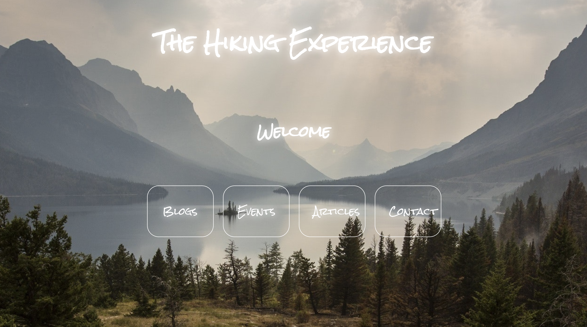
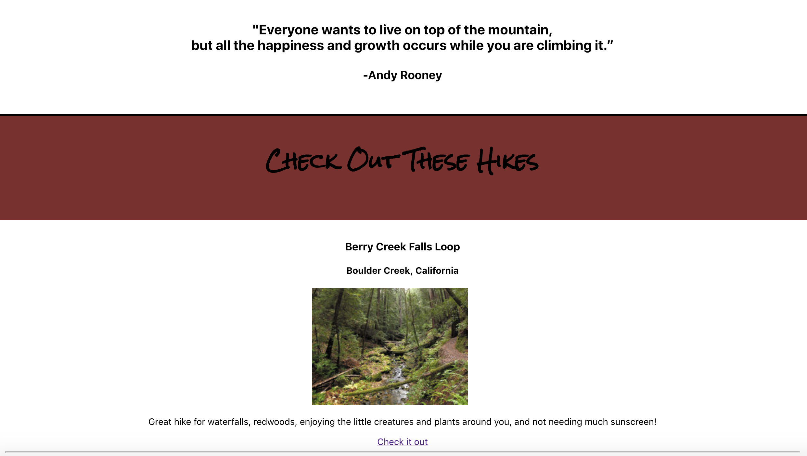
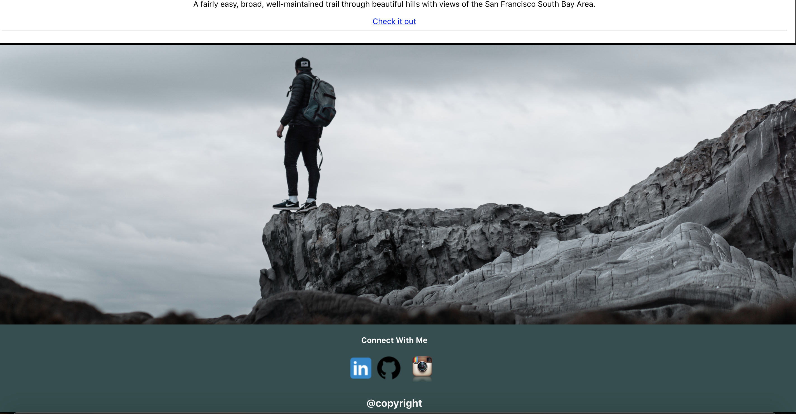
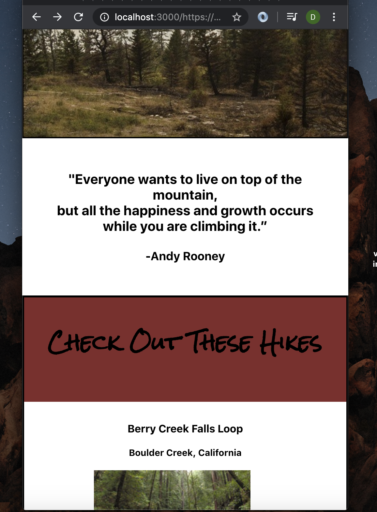
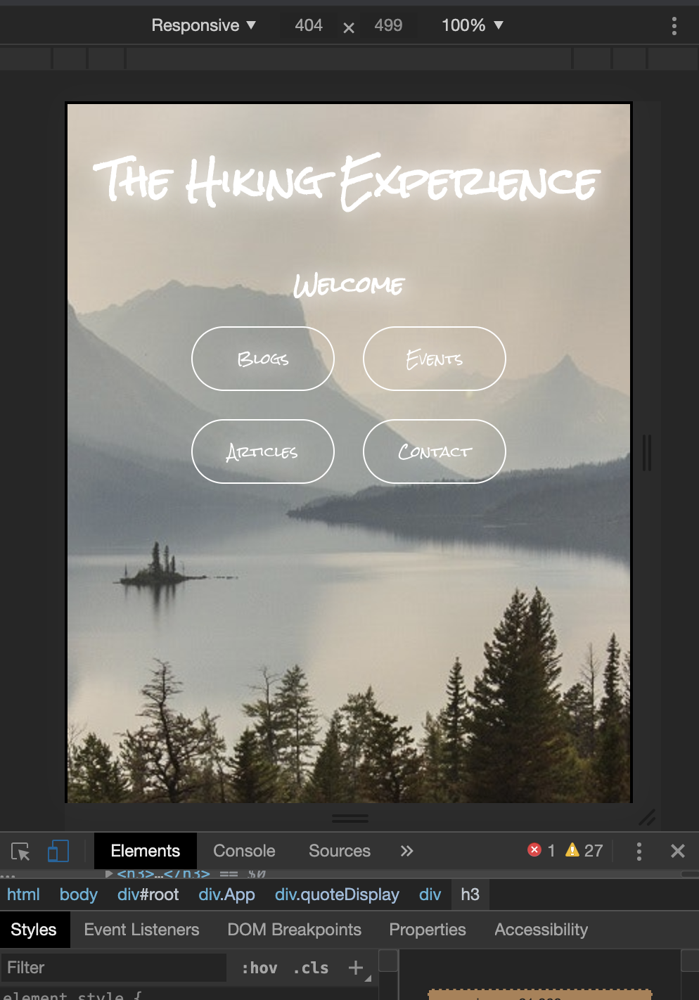

Hiking_App

***************************************************

Currently working on creating a hiking webpage with html, css, javascript, fetch and react.js

     

Decided to combine the navigation bar into the top banner. The nav buttons aren't functional just yet because
those pages don't exist. 

For the hiking content, I used fetch to retrieve json data from www.hikingproject.com and display it onto my webpage. 
Name of the hike, location, a short description and a link would be available if the user wants to learn more about the hike.
Once clicked would automatically direct the user to www.hikingproject.com where users will be able to see ratings, comments, etc.

     

At the end of the page I added a image right below the content and above the footer. The footer contains 
@copyright and allows users to connect with me through various platforms or see some of my work.

     

The page is also responsive with media queries. This time I didn't use bootstrap. 

     

In smaller screens the nav bar will shrink and margins on top of "welcome" and nav will be decreased. 

     

Used: React.js, html, css, and fetch.