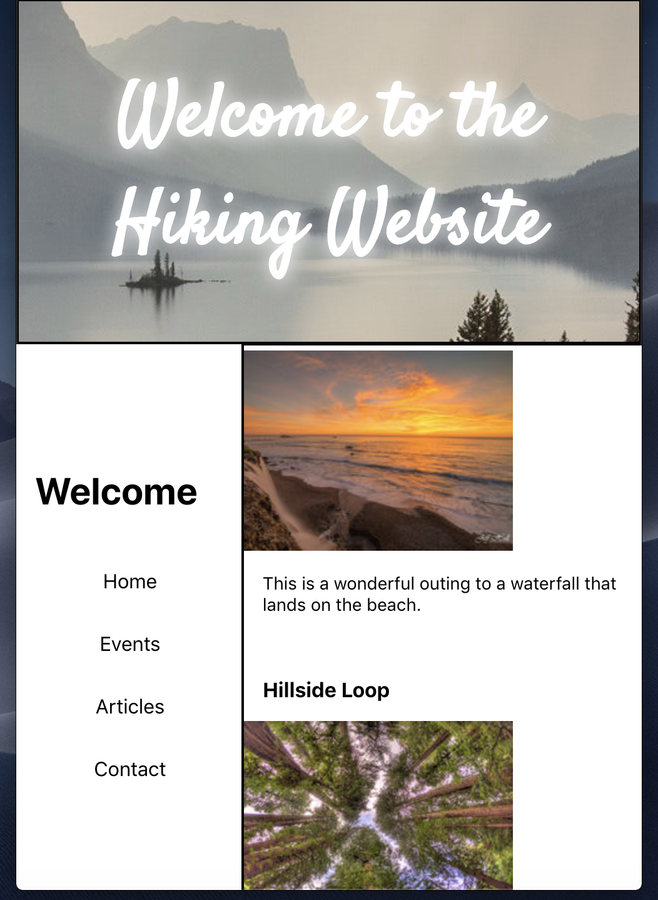
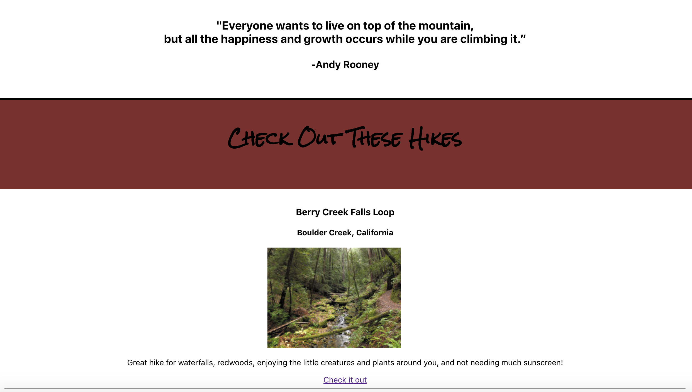

Hiking_App

***************************************************

Currently working on creating a hiking webpage with html, css, javascript, fetch and react.js

     

For the hiking content, I used fetch to retrieve json data from www.hikingproject.com and display it onto my webpage. 

     

App is not deployed yet. Just started this and will continue to add features such as authentication of the user, 
more responsive frontend design as well as more features for the user. 